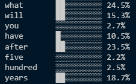
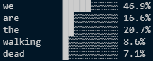

# Attention Visualizer

A small terminal tool that shows where GPT-2 "looks" when reading a sentence.
Type a sentence, pick a word, and see how much attention that word paid to
every other word. shown as bars and percentages.

Built to understand how transformer attention actually works, from the inside.

## What it does

- Runs a sentence through GPT-2 small (locally, no API)
- Pulls out the attention weights for a chosen layer and head
- Prints the sentence with a bar + percentage showing where the queried
  word's attention went

## Example

